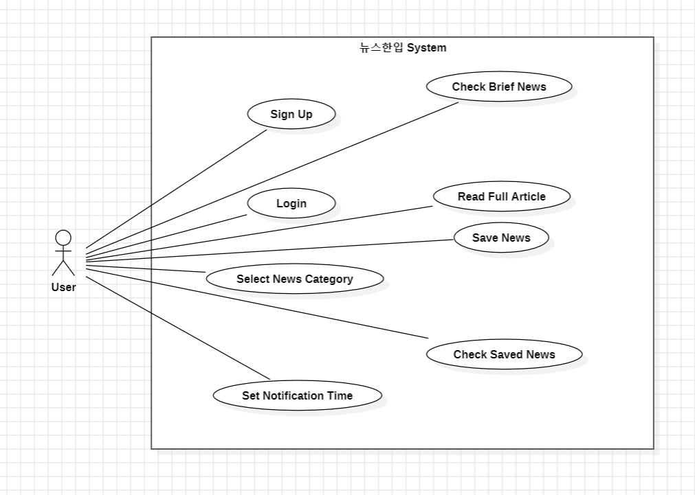

# Analysis

- Student No: 22212059
- Name: 김명섭
- E-mail: eigfid@naver.com

---

## Revision history

| Revision date | Version # | Description | Author |

| 2026-03-26 | 1.0 | First draft | 김명섭 |

---

## = Contents =

1. Introduction  
2. Use case analysis  
3. Domain Analysis  
4. User Interface prototype  
5. Glossary  
6. References  

---

## 1. Introduction

### 1) Summary

뉴스한입은 사용자가 직접 뉴스를 찾지 않아도 매일 아침 주요 뉴스를 짧게 확인할 수 있도록 도와주는 안드로이드 애플리케이션이다.

요즘 젊은 세대는 휴대폰으로 다양한 콘텐츠를 소비하지만, 상대적으로 뉴스에는 쉽게 접근하지 않는 경우가 많다. 이로 인해 중요한 사회 이슈를 늦게 알게 되거나, 아예 모르고 지나가는 경우도 생길 수 있다.

이 애플리케이션은 이러한 문제를 조금이라도 줄이기 위해 기획되었다. 사용자는 관심 있는 뉴스 카테고리를 선택하고, 원하는 시간에 아침 뉴스 알림을 받을 수 있다. 또한 요약된 뉴스를 간단히 확인한 뒤 필요하면 원문 기사도 볼 수 있다.

### 2) Describe the features of project

- 회원가입 및 로그인
- 뉴스 카테고리 선택
- 아침 뉴스 알림 시간 설정
- 요약 뉴스 확인
- 원문 기사 보기
- 뉴스 저장 및 저장 뉴스 확인

---

## 2. Use case analysis

### 1) Use case diagram

Use case diagram은 StarUML을 이용하여 작성하였다.

### 2) Use case description

#### Use Case #1 : Sign Up

**GENERAL CHARACTERISTICS**

- **Summary**  
  사용자가 뉴스한입 앱에 회원가입하여 계정을 생성하는 기능

- **Scope**  
  뉴스한입 System

- **Level**  
  User level

- **Author**  
  김명섭

- **Last Update**  
  2026-03-26

- **Status**  
  Analysis

- **Primary Actor**  
  User

- **Preconditions**  
  사용자가 앱을 처음 실행한 상태여야 한다.

- **Trigger**  
  회원가입 화면에서 이름, 이메일, 비밀번호를 입력하고 회원가입 버튼을 눌렀을 때

- **Success Post Condition**  
  사용자의 계정이 정상적으로 생성된다.

- **Failed Post Condition**  
  계정 생성에 실패하여 회원가입이 완료되지 않는다.

**MAIN SUCCESS SCENARIOS**

1. 사용자가 회원가입 화면에 진입한다.  
2. 이름, 이메일, 비밀번호를 입력한다.  
3. 회원가입 버튼을 누른다.  
4. 시스템은 입력된 정보를 저장한다.  
5. 회원가입이 완료되며 Use Case는 끝이 난다.

**EXTENSION SCENARIOS**

- **1a.** 입력값이 비어 있는 경우  
  - 시스템은 모든 정보를 입력하라는 메시지를 보여준다.

- **2a.** 이미 등록된 이메일인 경우  
  - 시스템은 이미 가입된 이메일이라는 메시지를 보여준다.

**RELATED INFORMATION**

- **Performance** : <= 5초  
- **Frequency** : 낮음  
- **Concurrency** : 제한 없음  
- **Due Date** : -

---

#### Use Case #2 : Login

**GENERAL CHARACTERISTICS**

- **Summary**  
  사용자가 뉴스한입 앱에 로그인하여 주요 기능을 사용할 수 있도록 하는 기능

- **Scope**  
  뉴스한입 System

- **Level**  
  User level

- **Author**  
  김명섭

- **Last Update**  
  2026-03-26

- **Status**  
  Analysis

- **Primary Actor**  
  User

- **Preconditions**  
  사용자가 뉴스한입에 회원가입이 되어 있어야 한다.

- **Trigger**  
  로그인 화면에서 이메일과 비밀번호를 입력하고 로그인 버튼을 눌렀을 때

- **Success Post Condition**  
  사용자는 로그인에 성공하여 뉴스한입의 기능을 사용할 수 있다.

- **Failed Post Condition**  
  사용자는 로그인에 실패하여 뉴스한입의 기능을 사용할 수 없다.

**MAIN SUCCESS SCENARIOS**

1. 사용자가 로그인 화면에 진입한다.  
2. 이메일과 비밀번호를 입력한다.  
3. 로그인 버튼을 누른다.  
4. 시스템은 입력된 정보를 저장된 사용자 정보와 비교한다.  
5. 로그인에 성공하면 메인 화면으로 이동하며 Use Case는 끝이 난다.

**EXTENSION SCENARIOS**

- **1a.** 이메일 또는 비밀번호를 입력하지 않은 경우  
  - 시스템은 이메일과 비밀번호를 모두 입력하라는 메시지를 보여준다.

- **2a.** 입력 정보가 등록된 정보와 일치하지 않는 경우  
  - 시스템은 로그인에 실패했다는 메시지를 보여준다.

**RELATED INFORMATION**

- **Performance** : <= 5초  
- **Frequency** : Variable  
- **Concurrency** : 제한 없음  
- **Due Date** : -

---

#### Use Case #3 : Select News Category

**GENERAL CHARACTERISTICS**

- **Summary**  
  사용자가 관심 있는 뉴스 카테고리를 선택하는 기능

- **Scope**  
  뉴스한입 System

- **Level**  
  User level

- **Author**  
  김명섭

- **Last Update**  
  2026-03-26

- **Status**  
  Analysis

- **Primary Actor**  
  User

- **Preconditions**  
  사용자가 로그인한 상태여야 한다.

- **Trigger**  
  카테고리 설정 화면에서 원하는 뉴스 카테고리를 선택했을 때

- **Success Post Condition**  
  선택한 뉴스 카테고리가 저장된다.

- **Failed Post Condition**  
  카테고리 저장이 되지 않는다.

**MAIN SUCCESS SCENARIOS**

1. 사용자가 카테고리 설정 화면에 진입한다.  
2. 정치, 경제, 사회, IT 등 원하는 카테고리를 선택한다.  
3. 저장 버튼을 누른다.  
4. 시스템은 선택한 카테고리를 저장한다.  
5. 카테고리 설정이 완료된다.

**EXTENSION SCENARIOS**

- **1a.** 아무 카테고리도 선택하지 않은 경우  
  - 시스템은 하나 이상의 카테고리를 선택하라는 메시지를 보여준다.

**RELATED INFORMATION**

- **Performance** : <= 5초  
- **Frequency** : 낮음  
- **Concurrency** : 제한 없음  
- **Due Date** : -

---

#### Use Case #4 : Set Notification Time

**GENERAL CHARACTERISTICS**

- **Summary**  
  사용자가 뉴스 알림 시간을 설정하는 기능

- **Scope**  
  뉴스한입 System

- **Level**  
  User level

- **Author**  
  김명섭

- **Last Update**  
  2026-03-26

- **Status**  
  Analysis

- **Primary Actor**  
  User

- **Preconditions**  
  사용자가 로그인한 상태여야 한다.

- **Trigger**  
  알림 설정 화면에서 원하는 시간을 선택했을 때

- **Success Post Condition**  
  알림 시간이 저장된다.

- **Failed Post Condition**  
  알림 시간이 저장되지 않는다.

**MAIN SUCCESS SCENARIOS**

1. 사용자가 알림 설정 화면에 진입한다.  
2. 원하는 알림 시간을 선택한다.  
3. 저장 버튼을 누른다.  
4. 시스템은 알림 시간을 저장한다.  
5. 알림 설정이 완료된다.

**EXTENSION SCENARIOS**

- **1a.** 사용자가 저장하지 않고 화면을 나간 경우  
  - 기존 설정이 유지된다.

**RELATED INFORMATION**

- **Performance** : <= 5초  
- **Frequency** : 낮음  
- **Concurrency** : 제한 없음  
- **Due Date** : -

---

#### Use Case #5 : Check Brief News

**GENERAL CHARACTERISTICS**

- **Summary**  
  사용자가 요약된 뉴스 목록을 확인하는 기능

- **Scope**  
  뉴스한입 System

- **Level**  
  User level

- **Author**  
  김명섭

- **Last Update**  
  2026-03-26

- **Status**  
  Analysis

- **Primary Actor**  
  User

- **Preconditions**  
  시스템에 뉴스 데이터가 존재해야 한다.

- **Trigger**  
  사용자가 메인 화면 또는 뉴스 목록 화면에 진입했을 때

- **Success Post Condition**  
  사용자가 요약된 뉴스 내용을 확인할 수 있다.

- **Failed Post Condition**  
  뉴스 목록이 정상적으로 표시되지 않는다.

**MAIN SUCCESS SCENARIOS**

1. 사용자가 메인 화면에 진입한다.  
2. 시스템은 요약 뉴스 목록을 불러온다.  
3. 뉴스 제목과 짧은 요약 내용을 보여준다.  
4. 사용자는 원하는 뉴스를 선택한다.

**EXTENSION SCENARIOS**

- **1a.** 불러올 뉴스가 없는 경우  
  - 시스템은 뉴스가 없다는 메시지를 보여준다.

**RELATED INFORMATION**

- **Performance** : <= 5초  
- **Frequency** : 높음  
- **Concurrency** : 제한 없음  
- **Due Date** : -

---

#### Use Case #6 : Read Full Article

**GENERAL CHARACTERISTICS**

- **Summary**  
  사용자가 원문 기사 내용을 확인하는 기능

- **Scope**  
  뉴스한입 System

- **Level**  
  User level

- **Author**  
  김명섭

- **Last Update**  
  2026-03-26

- **Status**  
  Analysis

- **Primary Actor**  
  User

- **Preconditions**  
  사용자가 특정 뉴스의 요약 내용을 보고 있어야 한다.

- **Trigger**  
  사용자가 원문 기사 보기 버튼을 눌렀을 때

- **Success Post Condition**  
  사용자가 원문 기사 링크를 통해 전체 기사를 볼 수 있다.

- **Failed Post Condition**  
  원문 기사 링크 연결에 실패한다.

**MAIN SUCCESS SCENARIOS**

1. 사용자가 뉴스 상세 화면에 진입한다.  
2. 원문 기사 보기 버튼을 누른다.  
3. 시스템은 원문 기사 링크를 연다.  
4. 사용자는 전체 기사 내용을 확인한다.

**EXTENSION SCENARIOS**

- **1a.** 원문 기사 링크가 없는 경우  
  - 시스템은 링크를 제공할 수 없다는 메시지를 보여준다.

**RELATED INFORMATION**

- **Performance** : <= 5초  
- **Frequency** : Variable  
- **Concurrency** : 제한 없음  
- **Due Date** : -

---

#### Use Case #7 : Save News

**GENERAL CHARACTERISTICS**

- **Summary**  
  사용자가 나중에 다시 보고 싶은 뉴스를 저장하는 기능

- **Scope**  
  뉴스한입 System

- **Level**  
  User level

- **Author**  
  김명섭

- **Last Update**  
  2026-03-26

- **Status**  
  Analysis

- **Primary Actor**  
  User

- **Preconditions**  
  사용자가 뉴스 상세 화면 또는 뉴스 목록 화면을 보고 있어야 한다.

- **Trigger**  
  사용자가 저장 버튼을 눌렀을 때

- **Success Post Condition**  
  해당 뉴스가 저장 목록에 추가된다.

- **Failed Post Condition**  
  뉴스 저장이 되지 않는다.

**MAIN SUCCESS SCENARIOS**

1. 사용자가 저장하고 싶은 뉴스를 선택한다.  
2. 저장 버튼을 누른다.  
3. 시스템은 해당 뉴스를 저장 목록에 추가한다.  
4. 저장 완료 메시지를 보여준다.

**EXTENSION SCENARIOS**

- **1a.** 이미 저장된 뉴스인 경우  
  - 시스템은 이미 저장된 뉴스라는 메시지를 보여준다.

**RELATED INFORMATION**

- **Performance** : <= 5초  
- **Frequency** : Variable  
- **Concurrency** : 제한 없음  
- **Due Date** : -

---

#### Use Case #8 : Check Saved News

**GENERAL CHARACTERISTICS**

- **Summary**  
  사용자가 저장한 뉴스 목록을 다시 확인하는 기능

- **Scope**  
  뉴스한입 System

- **Level**  
  User level

- **Author**  
  김명섭

- **Last Update**  
  2026-03-26

- **Status**  
  Analysis

- **Primary Actor**  
  User

- **Preconditions**  
  저장된 뉴스가 존재해야 한다.

- **Trigger**  
  사용자가 저장 뉴스 화면에 진입했을 때

- **Success Post Condition**  
  사용자가 저장된 뉴스 목록을 다시 확인할 수 있다.

- **Failed Post Condition**  
  저장 뉴스 목록이 표시되지 않는다.

**MAIN SUCCESS SCENARIOS**

1. 사용자가 저장 뉴스 화면에 진입한다.  
2. 시스템은 저장된 뉴스 목록을 불러온다.  
3. 저장된 뉴스 제목과 날짜를 보여준다.  
4. 사용자는 원하는 뉴스를 다시 확인한다.

**EXTENSION SCENARIOS**

- **1a.** 저장된 뉴스가 없는 경우  
  - 시스템은 저장된 뉴스가 없다는 메시지를 보여준다.

**RELATED INFORMATION**

- **Performance** : <= 5초  
- **Frequency** : Variable  
- **Concurrency** : 제한 없음  
- **Due Date** : -

---

## 3. Domain Analysis

### 1) User

뉴스한입 앱을 사용하는 사용자 정보를 저장하는 클래스이다. 회원가입과 로그인에 필요한 기본 정보가 저장되며, 이후 뉴스 카테고리 선택, 알림 시간 설정, 저장 뉴스 확인 등의 기능도 이 사용자 정보를 기준으로 이루어진다.

### 2) News

외부 뉴스 API에서 받아온 뉴스 기사 정보를 저장하는 클래스이다. 뉴스 제목, 간단한 요약 내용, 원문 기사 링크, 카테고리, 발행 날짜 등의 정보가 포함된다. 사용자는 이 클래스를 통해 요약 뉴스를 확인하고 원문 기사도 볼 수 있다.

### 3) Category

뉴스를 정치, 경제, 사회, IT 등의 분야로 구분하기 위한 클래스이다. 사용자가 원하는 뉴스 분야를 선택할 때 사용되며, 시스템은 이 정보를 바탕으로 사용자가 관심 있어 하는 뉴스를 우선적으로 보여준다.

### 4) NotificationSetting

사용자의 뉴스 알림 설정 정보를 저장하는 클래스이다. 사용자가 원하는 아침 알림 시간과 알림 사용 여부를 기록하며, 시스템은 이 클래스를 통해 정해진 시간에 뉴스 알림을 보낼 수 있다.

### 5) SavedNews

사용자가 나중에 다시 보기 위해 저장한 뉴스 목록을 관리하는 클래스이다. 어떤 사용자가 어떤 뉴스를 저장했는지 기록하며, 저장한 뉴스는 앱 안에서 다시 확인하거나 삭제할 수 있다.

---

## 4. User Interface prototype

### 1) Main screen

============================================================
                        << 뉴스한입 >>
============================================================
오늘의 요약 뉴스

1. [정치] 청년 지원 정책 확대 추진
   - 정부가 청년 지원 범위를 확대할 예정

2. [경제] 기준금리 동결 가능성 커짐
   - 물가 안정 추세로 동결 전망

3. [IT] 국내 AI 서비스 경쟁 심화
   - 여러 기업이 신규 기능 공개

------------------------------------------------------------
1. 뉴스 보기   2. 저장 뉴스   3. 카테고리 설정   4. 알림 설정
============================================================

System이 시작되면 메인 화면이 출력된다.
사용자는 이 화면에서 오늘의 요약 뉴스 목록을 확인할 수 있다.
또한 저장 뉴스, 카테고리 설정, 알림 설정 화면으로 이동할 수 있다.

### 2) Registration

============================================================
                        << 회원가입 >>
============================================================
회원님의 정보를 입력해주세요

이름 : 김명섭
E-mail : eigfid@naver.com
Password : ********

------------------------------------------------------------
1. 회원가입 완료   2. 뒤로가기
============================================================

사용자가 회원가입을 할 때 실행되는 Interface다.
이름, 이메일, 비밀번호와 같은 기본 정보를 입력하면 회원가입을 진행할 수 있다.
이미 등록된 이메일일 경우 회원가입이 되지 않는다.

### 3) Login

============================================================
                          << Login >>
============================================================
E-mail : eigfid@naver.com
Password : ********

------------------------------------------------------------
1. 로그인   2. 회원가입
============================================================
로그인 성공
============================================================

모든 기능에 접근하기 위해서는 로그인이 필요하다.
회원가입 시 입력한 이메일과 비밀번호를 통해 로그인할 수 있다.
올바르지 않은 정보를 입력한 경우 로그인에 실패한다.

### 4) Category setting

============================================================
                    << 뉴스 카테고리 설정 >>
============================================================
관심 있는 카테고리를 선택해주세요

[ ] 정치
[ ] 경제
[ ] 사회
[ ] IT
[ ] 문화

------------------------------------------------------------
1. 저장   2. 뒤로가기
============================================================

사용자가 관심 있는 뉴스 분야를 선택하는 Interface다.
정치, 경제, 사회, IT 등 원하는 카테고리를 선택할 수 있다.
저장 후에는 선택한 카테고리를 기준으로 뉴스가 우선적으로 제공된다.

### 5) Notification setting

============================================================
                     << 알림 시간 설정 >>
============================================================
뉴스 알림 시간 : 오전 07 : 00
알림 사용 여부 : ON

------------------------------------------------------------
1. 저장   2. 뒤로가기
============================================================

사용자가 뉴스 알림 시간을 설정하는 Interface다.
원하는 아침 시간대를 직접 선택할 수 있으며, 알림 사용 여부도 함께 설정할 수 있다.
저장된 시간에 맞추어 시스템이 뉴스 알림을 보낸다.

### 6) News detail

============================================================
                     << 뉴스 상세 보기 >>
============================================================
제목 : 청년 지원 정책 확대 추진

요약 :
정부가 청년 지원 범위를 넓히고
신청 절차를 간소화하는 방안을 검토 중이다.

------------------------------------------------------------
1. 원문 기사 보기   2. 뉴스 저장   3. 뒤로가기
============================================================

사용자가 특정 뉴스의 자세한 내용을 확인하는 Interface다.
뉴스 제목과 요약 내용을 확인할 수 있으며, 원문 기사로 이동할 수도 있다.
또한 해당 뉴스를 저장하여 나중에 다시 볼 수 있다.

### 7) Saved news

============================================================
                     << 저장한 뉴스 목록 >>
============================================================
1. [경제] 기준금리 동결 가능성 커짐
2. [IT] 국내 AI 서비스 경쟁 심화
3. [사회] 청년 주거 지원 확대 논의

------------------------------------------------------------
1. 뉴스 선택   2. 삭제   3. 뒤로가기
============================================================

사용자가 저장해 둔 뉴스 목록을 다시 확인하는 Interface다.
저장한 뉴스 제목을 목록 형태로 볼 수 있고, 필요하면 다시 열어보거나 삭제할 수 있다.
나중에 다시 보고 싶은 뉴스를 관리하는 데 사용된다.

---

## 5. Glossary

1) User

뉴스한입 앱을 사용하는 일반 사용자를 의미한다.

2) News

외부 API에서 받아온 뉴스 기사 정보를 의미한다.

3) Category

정치, 경제, 사회, IT 등 뉴스 분야를 구분하는 단위를 의미한다.

4) NotificationSetting

사용자가 설정한 뉴스 알림 시간과 알림 사용 여부에 대한 정보를 의미한다.

5) SavedNews

사용자가 저장해 둔 뉴스 목록을 의미한다.

6) Brief News

긴 기사 대신 핵심 내용만 짧게 정리한 뉴스를 의미한다.

7) Full Article

요약 뉴스와 연결되는 원문 기사를 의미한다.

---

## 6. References

Reuters Institute, Digital News Report 2025
https://reutersinstitute.politics.ox.ac.uk/digital-news-report/2025
NAVER Developers, 검색 > 뉴스 - Search API
https://developers.naver.com/docs/serviceapi/search/news/news.md
Android Developers, About notifications in Views
https://developer.android.com/develop/ui/views/notifications
