# 뉴스한입

-Design-

| Student No | 22212059                                    |
| ---------- | ------------------------------------------- |
| Name       | 김명섭                                         |
| E-Mail     | [eigfid@naver.com](mailto:eigfid@naver.com) |

---

# [ Revision history ]

| Revision date | Version # | Description                              | Author |
| ------------- | --------: | ---------------------------------------- | ------ |
| 2026/03/25    | 1.00      | Conceptualization 초안 작성                  | 김명섭    |
| 2026/03/26    | 1.01      | Analysis 문서 작성 및 Use Case Description 정리 | 김명섭    |
| 2026/03/26    | 1.02      | Domain Analysis 작성 및 주요 클래스 정리           | 김명섭    |
| 2026/05/08    | 1.03      | 사용자 기능 흐름 다이어그램 작성                       | 김명섭    |
| 2026/06/03    | 1.04      | Design 문서 작성 및 다이어그램 삽입 구조 정리            | 김명섭    |

---

# = Contents =

1. Introduction
2. Class diagram
3. Sequence diagram
4. State machine diagram
5. Implementation requirements
6. Glossary
7. References

---

# 1. Introduction

현대 사회에서는 스마트폰과 인터넷을 통해 수많은 정보가 빠르게 전달되고 있다. 하지만 정보의 양이 많아진 만큼 사용자가 중요한 뉴스를 직접 찾아보고 이해하는 데에는 많은 시간이 필요하다. 특히 젊은 층은 학업, 아르바이트, 개인 일정 등으로 인해 긴 뉴스 기사를 매일 확인하기 어렵고, 사회적으로 중요한 이슈를 놓치는 경우가 많다.

기존 뉴스 서비스는 사용자가 직접 앱을 실행하여 기사를 탐색하거나, 긴 기사 내용을 읽어야 하는 방식이 많다. 이 과정에서 사용자는 제목만 보고 넘어가거나, 관심 있는 분야의 기사만 확인하게 되어 중요한 사회적 이슈를 놓칠 수 있다. 또한 아침 시간처럼 바쁜 시간대에는 여러 기사를 하나씩 확인하기 어렵기 때문에, 짧고 핵심적인 뉴스 요약 기능이 필요하다고 판단하였다.

“뉴스한입”은 사용자가 설정한 카테고리와 알림 시간에 맞추어 전날 또는 최근 주요 뉴스를 가져오고, 핵심 내용을 간단히 요약하여 알림으로 제공하는 Android 기반 모바일 애플리케이션이다. 사용자는 앱을 통해 관심 카테고리, 알림 시간, 무음 시간 등을 설정할 수 있으며, 알림을 통해 전달된 뉴스 요약을 확인하고 필요한 경우 원문 기사로 이동할 수 있다.

이 프로그램을 만들어서 이루고자 하는 첫 번째 목표는 뉴스 접근성 향상이다. 사용자가 직접 여러 뉴스 사이트를 방문하지 않아도 주요 이슈를 짧게 확인할 수 있도록 한다. 두 번째 목표는 개인화된 뉴스 전달이다. 사용자가 관심 있는 카테고리와 알림 시간을 설정하여 자신에게 맞는 방식으로 뉴스를 받아볼 수 있게 한다. 세 번째 목표는 간단한 사용성이다. 복잡한 회원가입이나 서버 기능 없이 Android 앱 내부에서 설정, 저장, 읽음 처리, 알림 기능을 수행하도록 구성한다.

본 시스템의 주 타겟은 뉴스를 꾸준히 확인하고 싶지만 긴 기사를 매일 읽기 어려운 대학생 및 젊은 사용자이다. 또한 출근, 등교, 아침 준비 시간에 짧은 뉴스 요약을 받아보고 싶은 사용자도 주요 대상이 된다.

아래는 Analysis에 이은 이 System 개발의 세 번째 단계인 Design에 관한 내용으로써, 실제 System 구현에 직접적으로 관여하는 모든 요소들의 윤곽을 확정하고 구체적으로 디자인 해 나가는 내용을 다루고 있다. 본 문서의 모든 세부 사항은 직접적인 구현 시 소스코드상에서의 용례와 완벽히 일치함을 목적으로 한다.

---

# 2. Class diagram

아래의 그림은 시스템의 Class Diagram을 표현한 그림이다.

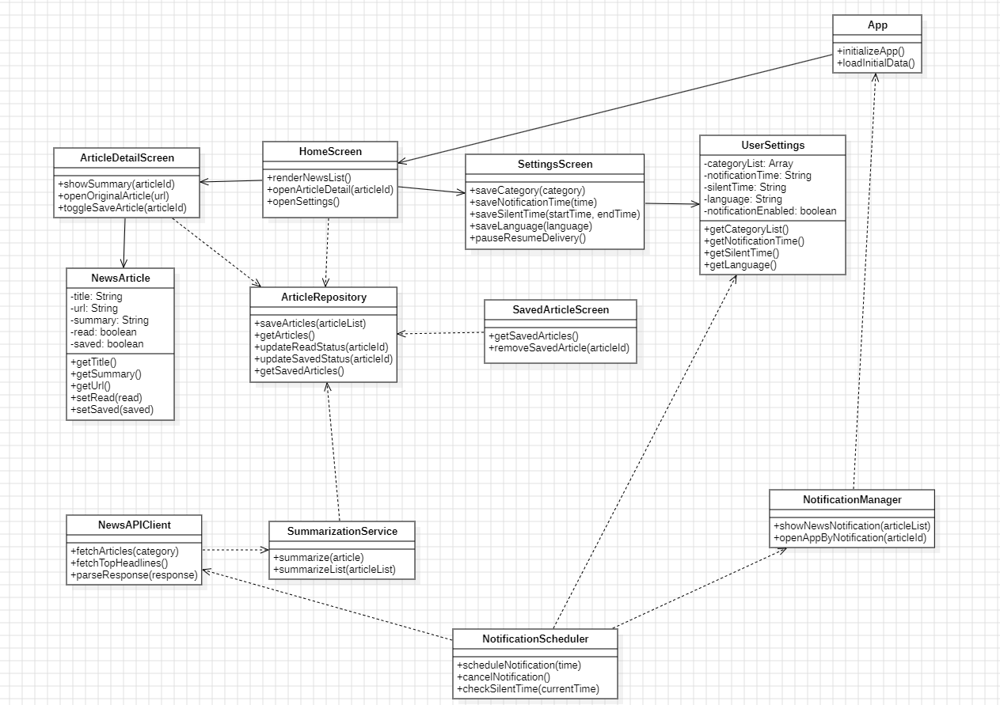

아래의 표는 위의 Class Diagram에서 표현한 Class들의 대한 설명이다.

| Class Name            | Explanation                                                                                                                                                                                                                                                                                                                                   |
| --------------------- | --------------------------------------------------------------------------------------------------------------------------------------------------------------------------------------------------------------------------------------------------------------------------------------------------------------------------------------------- |
| App                   | 시스템이 실행될 때 가장 먼저 실행되는 최상위 클래스이다. React Native 애플리케이션의 전체 화면 구조와 Navigation 구조를 관리한다.  - initializeApp() : 앱 실행 시 필요한 초기 설정을 수행하는 메소드이다. - loadInitialData() : 저장된 사용자 설정과 기사 데이터를 불러오는 메소드이다.                                                                                                                                        |
| HomeScreen            | 사용자가 앱을 실행했을 때 주요 뉴스 요약 목록을 확인하는 화면 클래스이다. 저장된 기사, 읽음 상태, 요약 내용을 화면에 표시한다.  - renderNewsList() : 뉴스 목록을 화면에 출력하는 메소드이다. - openArticleDetail(articleId : String) : 선택한 기사의 상세 화면으로 이동하는 메소드이다.                                                                                                                                        |
| ArticleDetailScreen   | 사용자가 선택한 뉴스의 요약 내용과 원문 이동 버튼을 확인하는 화면 클래스이다.  - showSummary(articleId : String) : 선택한 뉴스의 요약 내용을 보여주는 메소드이다. - openOriginalArticle(url : String) : 뉴스 원문 링크를 외부 브라우저로 여는 메소드이다.                                                                                                                                                      |
| SettingsScreen        | 사용자가 뉴스 카테고리, 알림 시간, 무음 시간, 언어 설정 등을 관리하는 화면 클래스이다.  - saveCategory(category : String) : 사용자가 선택한 카테고리를 저장하는 메소드이다. - saveNotificationTime(time : String) : 사용자가 설정한 알림 시간을 저장하는 메소드이다. - saveSilentTime(startTime : String, endTime : String) : 알림을 받지 않을 무음 시간을 저장하는 메소드이다.                                                     |
| UserSettings          | 사용자의 설정 정보가 저장되는 클래스이다. 카테고리, 알림 시간, 무음 시간, 언어 설정, 알림 활성화 여부를 관리한다.  - getCategoryList() : 사용자가 구독한 카테고리 목록을 반환하는 메소드이다. - getNotificationTime() : 저장된 알림 시간을 반환하는 메소드이다. - getSilentTime() : 저장된 무음 시간 정보를 반환하는 메소드이다. - getLanguage() : 사용자가 선택한 언어 설정을 반환하는 메소드이다.                                                          |
| NewsArticle           | 뉴스 기사 하나의 정보를 저장하는 클래스이다. 제목, 원문 URL, 발행 시간, 카테고리, 요약문, 읽음 여부, 저장 여부를 가진다.  - getTitle() : 뉴스 제목을 반환하는 메소드이다. - getSummary() : 요약된 뉴스 내용을 반환하는 메소드이다. - getUrl() : 원문 기사 주소를 반환하는 메소드이다. - setRead(read : boolean) : 기사 읽음 여부를 변경하는 메소드이다. - setSaved(saved : boolean) : 기사 저장 여부를 변경하는 메소드이다.                              |
| NewsAPIClient         | 외부 News API와 통신하여 뉴스 기사 데이터를 가져오는 클래스이다.  - fetchArticles(category : String) : 선택한 카테고리에 해당하는 뉴스 목록을 가져오는 메소드이다. - fetchTopHeadlines() : 주요 뉴스 목록을 가져오는 메소드이다. - parseResponse(response : Object) : API 응답 데이터를 NewsArticle 형태로 변환하는 메소드이다.                                                                                       |
| SummarizationService  | NewsAPIClient를 통해 가져온 기사 내용을 짧은 요약문으로 변환하는 클래스이다.  - summarize(article : NewsArticle) : 기사 내용을 요약하는 메소드이다. - summarizeList(articleList : Array) : 여러 개의 기사 목록을 순서대로 요약하는 메소드이다.                                                                                                                                                      |
| NotificationScheduler | 사용자가 설정한 알림 시간에 맞추어 뉴스 알림 작업을 예약하는 클래스이다.  - scheduleNotification(time : String) : 지정된 시간에 알림이 발생하도록 예약하는 메소드이다. - cancelNotification() : 기존에 예약된 알림을 취소하는 메소드이다. - checkSilentTime(currentTime : String) : 현재 시간이 무음 시간에 포함되는지 확인하는 메소드이다.                                                                                       |
| NotificationManager   | 실제 Android 알림을 생성하고 사용자에게 보여주는 클래스이다.  - showNewsNotification(articleList : Array) : 요약된 뉴스 목록을 알림으로 보여주는 메소드이다. - openAppByNotification(articleId : String) : 사용자가 알림을 누르면 해당 기사 또는 홈 화면으로 이동시키는 메소드이다.                                                                                                                             |
| ArticleRepository     | 앱 내부 저장소에 뉴스 기사 데이터를 저장하고 불러오는 클래스이다. 서버를 사용하지 않는 범위에서 로컬 저장소의 역할을 한다.  - saveArticles(articleList : Array) : 뉴스 기사 목록을 로컬 저장소에 저장하는 메소드이다. - getArticles() : 저장된 뉴스 기사 목록을 반환하는 메소드이다. - updateReadStatus(articleId : String) : 특정 기사의 읽음 상태를 변경하는 메소드이다. - updateSavedStatus(articleId : String) : 특정 기사의 저장 상태를 변경하는 메소드이다. |
| SavedArticleScreen    | 사용자가 저장한 기사만 따로 확인할 수 있는 화면 클래스이다.  - getSavedArticles() : 저장된 기사 목록만 가져오는 메소드이다. - removeSavedArticle(articleId : String) : 저장 목록에서 특정 기사를 제거하는 메소드이다.                                                                                                                                                                              |

---

# 3. Sequence diagram

아래에 나오는 그림들은 Conceptualization에서 표현한 기능들을 Sequence Diagram으로 표현한 그림들이다.

## 3.1 Open App by Notification

아래의 그림은 시스템의 기능 중 “Open App by Notification”에 대한 Sequence Diagram이다.

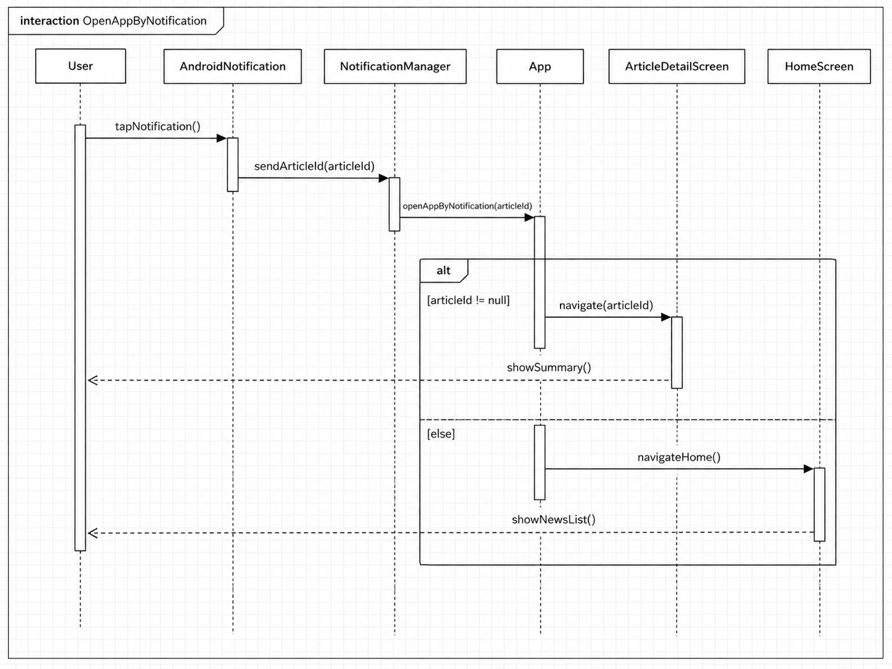

사용자가 Android Notification을 선택하면 “NotificationManager” 클래스가 알림에 포함된 articleId를 확인한다. 그 다음 “App” 클래스는 전달받은 articleId를 기준으로 Navigation을 수행한다. articleId가 존재하면 “ArticleDetailScreen”으로 이동하여 해당 뉴스의 요약 내용을 보여준다. 만약 articleId가 존재하지 않으면 “HomeScreen”을 실행하여 전체 뉴스 목록을 보여준다.

## 3.2 Subscribe Category and Time

아래의 그림은 시스템의 기능 중 “Subscribe Category and Time”에 대한 Sequence Diagram이다.

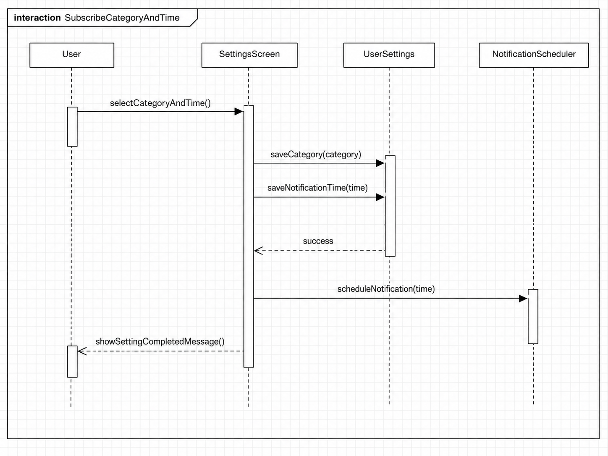

사용자가 “SettingsScreen”에서 관심 카테고리와 알림 시간을 선택하면 “UserSettings” 클래스가 해당 정보를 저장한다. 카테고리 정보는 뉴스 API 요청 시 사용되고, 알림 시간은 “NotificationScheduler” 클래스에서 알림 예약을 할 때 사용된다. 저장이 정상적으로 완료되면 사용자에게 설정 완료 메시지를 보여준다. 만약 입력값이 비어 있거나 잘못된 시간 형식이면 Error 메시지를 보여준다.

## 3.3 Fetch Articles and Summarize

아래의 그림은 시스템의 기능 중 “Fetch Articles and Summarize”에 대한 Sequence Diagram이다.

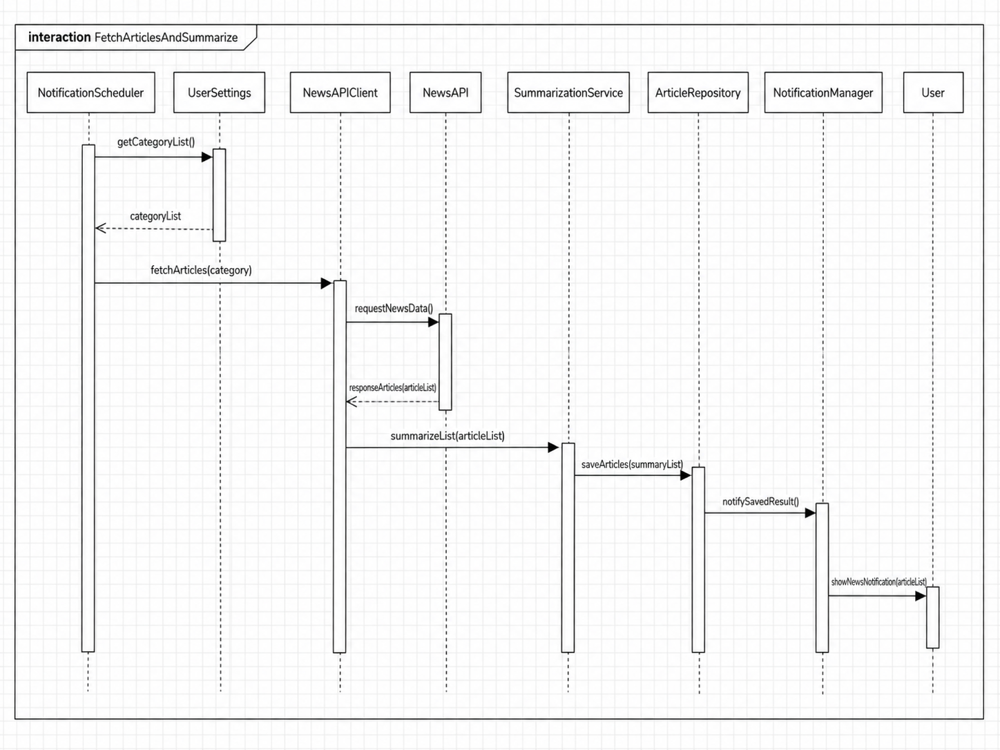

알림 시간이 되면 “NotificationScheduler” 클래스가 사용자의 카테고리 설정을 확인한다. 그 다음 “NewsAPIClient” 클래스가 선택된 카테고리에 맞는 뉴스를 외부 News API로부터 가져온다. 가져온 기사 데이터는 “SummarizationService” 클래스로 전달되고, 각 기사의 핵심 내용이 짧은 요약문으로 변환된다. 요약이 끝난 기사 목록은 “ArticleRepository”에 저장된다. 저장이 완료되면 “NotificationManager” 클래스가 사용자에게 뉴스 요약 알림을 보여준다.

## 3.4 Set Silent Time

아래의 그림은 시스템의 기능 중 “Set Silent Time”에 대한 Sequence Diagram이다.

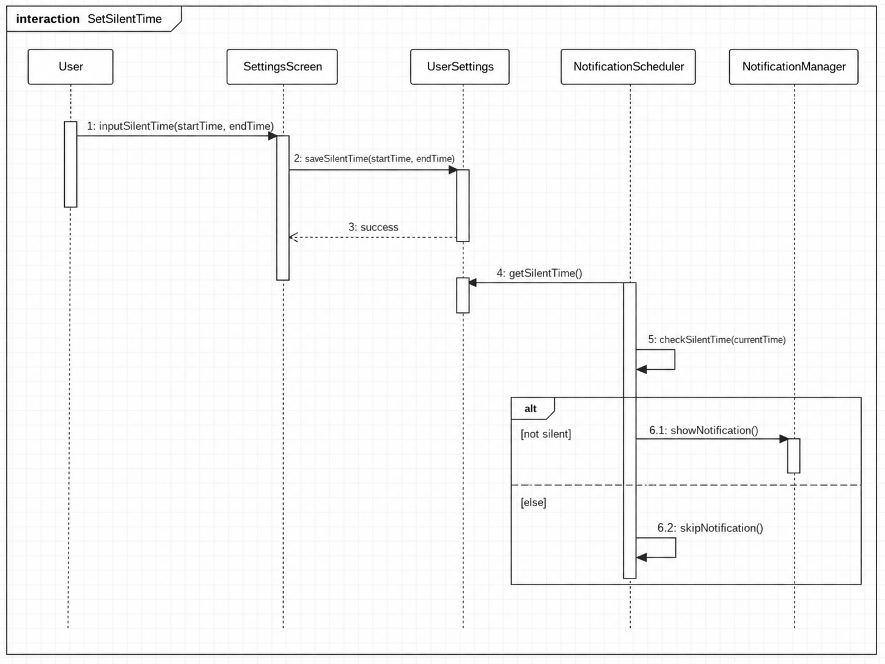

사용자가 “SettingsScreen”에서 무음 시작 시간과 종료 시간을 입력하면 “UserSettings” 클래스가 해당 정보를 저장한다. 이후 알림 시간이 되었을 때 “NotificationScheduler” 클래스는 현재 시간이 무음 시간에 포함되는지 검사한다. 현재 시간이 무음 시간에 포함되면 알림을 발생시키지 않는다. 현재 시간이 무음 시간에 포함되지 않으면 “NotificationManager” 클래스가 뉴스 요약 알림을 출력한다.

## 3.5 Mark as Read

아래의 그림은 시스템의 기능 중 “Mark as Read”에 대한 Sequence Diagram이다.

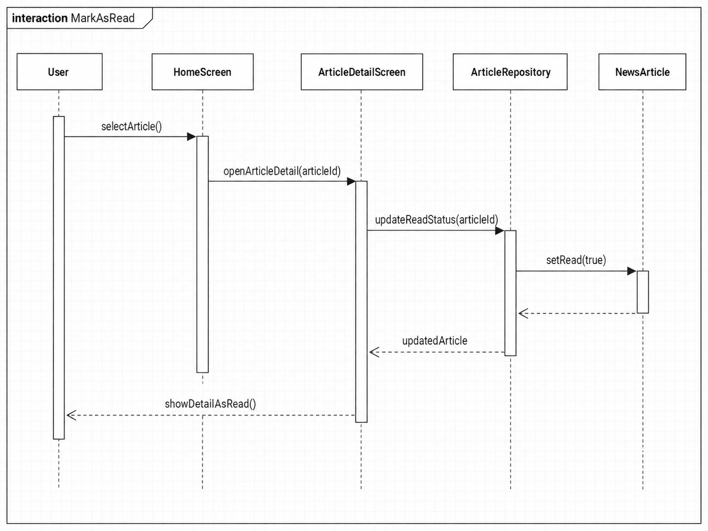

사용자가 “HomeScreen” 또는 “ArticleDetailScreen”에서 특정 기사를 확인하면 해당 articleId가 “ArticleRepository”로 전달된다. “ArticleRepository”는 해당 기사의 read 값을 true로 변경하고 저장한다. 그 다음 화면은 변경된 읽음 상태를 반영하여 사용자에게 표시한다.

## 3.6 Save Article

아래의 그림은 시스템의 기능 중 “Save Article”에 대한 Sequence Diagram이다.

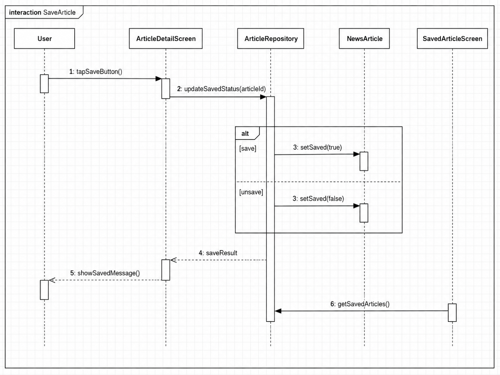

사용자가 기사 상세 화면에서 저장 버튼을 누르면 “ArticleDetailScreen”이 선택된 articleId를 “ArticleRepository”로 전달한다. “ArticleRepository”는 해당 기사의 saved 값을 true로 변경하고 로컬 저장소에 반영한다. 저장이 완료되면 사용자에게 저장 완료 메시지를 보여준다. 사용자가 이미 저장된 기사의 저장 버튼을 다시 누르면 saved 값을 false로 변경하여 저장 목록에서 제거한다.

## 3.7 Read Full Text

아래의 그림은 시스템의 기능 중 “Read Full Text”에 대한 Sequence Diagram이다.

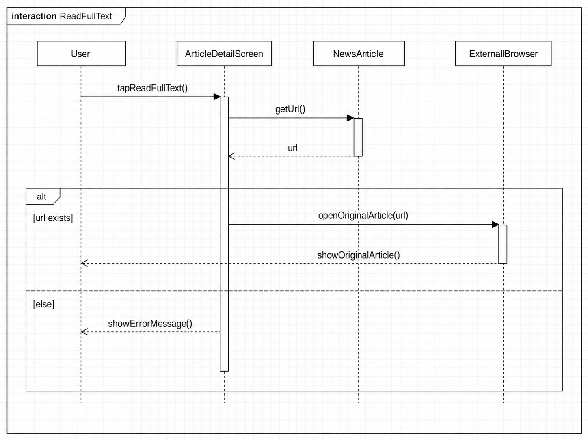

사용자가 “ArticleDetailScreen”에서 원문 보기 버튼을 누르면 “NewsArticle” 클래스에 저장된 원문 URL을 가져온다. 그 다음 “ArticleDetailScreen”은 외부 브라우저 또는 WebView를 실행하여 원문 기사 페이지를 보여준다. URL 값이 존재하지 않으면 Error 메시지를 출력한다.

## 3.8 Pause and Resume Delivery

아래의 그림은 시스템의 기능 중 “Pause and Resume Delivery”에 대한 Sequence Diagram이다.

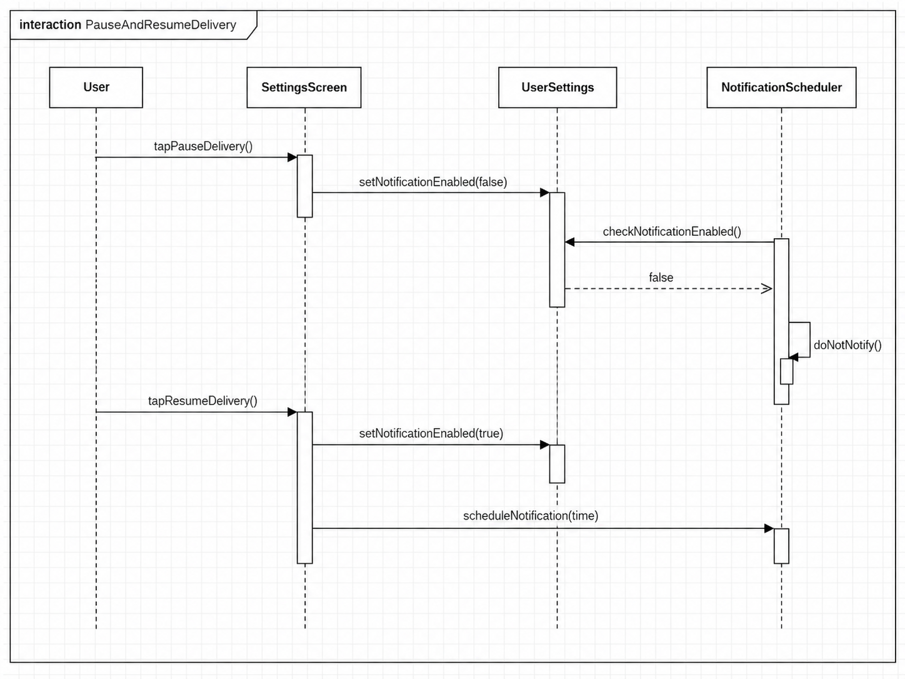

사용자가 “SettingsScreen”에서 알림 일시 중지를 선택하면 “UserSettings” 클래스의 notificationEnabled 값이 false로 저장된다. “NotificationScheduler”는 알림 실행 전에 notificationEnabled 값을 확인한다. 값이 false이면 알림을 발생시키지 않는다. 사용자가 다시 알림 재개를 선택하면 notificationEnabled 값이 true로 변경되고, 설정된 알림 시간에 맞추어 다시 뉴스 알림이 예약된다.

## 3.9 Language Setting

아래의 그림은 시스템의 기능 중 “Language Setting”에 대한 Sequence Diagram이다.

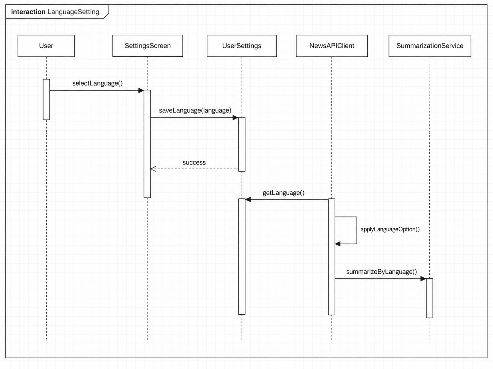

사용자가 “SettingsScreen”에서 언어를 선택하면 “UserSettings” 클래스가 language 값을 저장한다. 이후 “NewsAPIClient”는 저장된 language 값을 기준으로 뉴스 API 요청 조건을 설정한다. “SummarizationService”는 선택된 언어 설정에 맞게 요약 결과를 생성한다. 저장된 언어 설정은 다음 앱 실행 시에도 유지된다.

---

# 4. State machine diagram

아래의 그림은 뉴스한입 시스템의 State machine diagram을 표현한 그림이다.

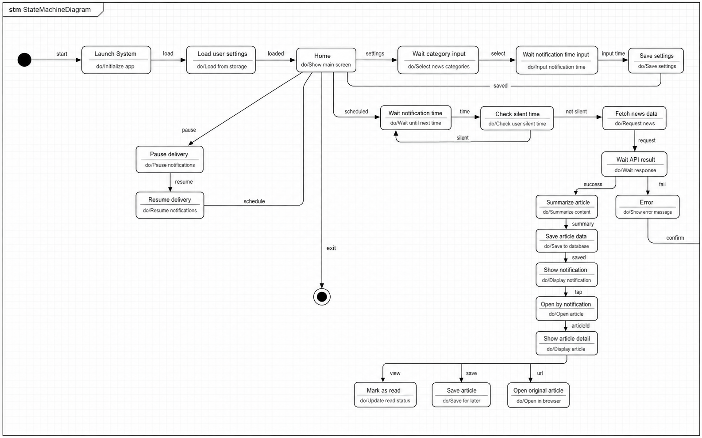

아래는 위의 State Machine Diagram에 나온 각 State들에 대해서 간단하게 설명한 표이다.

| Status                       | Explanation                                                                          |
| ---------------------------- | ------------------------------------------------------------------------------------ |
| Launch System                | 시스템이 실행된 상태이다.                                                                       |
| Load user settings           | 앱 실행 후 로컬 저장소에 저장된 사용자 설정 정보를 불러오는 상태이다. 카테고리, 알림 시간, 무음 시간, 언어 설정, 알림 활성화 여부를 가져온다. |
| Home                         | 시스템 내부에 들어온 사용자는 이 상태에서 뉴스 목록 확인, 기사 상세 보기, 설정 변경, 저장 기사 확인 등의 기능을 시작할 수 있다.         |
| Wait category input          | 사용자가 관심 뉴스 카테고리를 선택하는 상태이다. 선택된 카테고리는 UserSettings에 저장된다.                            |
| Wait notification time input | 사용자가 뉴스 알림을 받을 시간을 입력하는 상태이다. 입력된 시간은 NotificationScheduler에서 사용된다.                  |
| Save settings                | 사용자가 입력한 카테고리, 알림 시간, 무음 시간, 언어 설정 등을 저장하는 상태이다.                                     |
| Wait notification time       | 사용자가 설정한 알림 시간이 될 때까지 대기하는 상태이다.                                                     |
| Check silent time            | 알림 시간이 되었을 때 현재 시간이 무음 시간에 포함되는지 검사하는 상태이다. 무음 시간에 포함되면 알림을 발생시키지 않는다.               |
| Fetch news data              | NewsAPIClient가 외부 News API로부터 뉴스 기사 데이터를 가져오는 상태이다.                                  |
| Wait API result              | News API 요청 결과를 기다리는 상태이다. 정상적으로 데이터를 가져오면 요약 단계로 넘어가고, 실패하면 Error 상태로 이동한다.         |
| Summarize article            | SummarizationService가 기사 내용을 짧은 요약문으로 변환하는 상태이다.                                     |
| Save article data            | 요약이 끝난 뉴스 기사 데이터를 ArticleRepository에 저장하는 상태이다.                                      |
| Show notification            | NotificationManager가 사용자에게 뉴스 요약 알림을 보여주는 상태이다.                                      |
| Open by notification         | 사용자가 알림을 눌러 앱을 실행하는 상태이다. articleId가 존재하면 해당 기사 상세 화면으로 이동한다.                        |
| Show article detail          | 선택된 뉴스의 제목, 요약문, 원문 링크를 보여주는 상태이다.                                                   |
| Mark as read                 | 사용자가 기사를 확인했을 때 해당 기사의 읽음 상태를 true로 변경하는 상태이다.                                       |
| Save article                 | 사용자가 저장 버튼을 눌렀을 때 해당 기사의 저장 상태를 변경하는 상태이다.                                           |
| Open original article        | 사용자가 원문 보기 버튼을 눌렀을 때 외부 브라우저 또는 WebView로 원문 기사를 여는 상태이다.                             |
| Pause delivery               | 사용자가 알림 일시 중지를 선택하여 뉴스 알림을 받지 않도록 설정하는 상태이다.                                         |
| Resume delivery              | 사용자가 알림 재개를 선택하여 뉴스 알림을 다시 받을 수 있도록 설정하는 상태이다.                                       |
| Error                        | API 요청 실패, 네트워크 오류, 잘못된 URL, 잘못된 설정값 등 예외 상황이 발생한 상태이다.                              |
| Exit system                  | 사용자가 앱을 종료한 상태이다.                                                                    |

---

# 5. Implementation requirements

뉴스한입 시스템을 구현하기 위해 필요한 요구사항은 다음과 같다.

| Requirement           | Explanation                                                               |
| --------------------- | ------------------------------------------------------------------------- |
| Android 기반 모바일 애플리케이션 | 본 시스템은 React Native를 이용하여 Android 환경에서 실행되는 모바일 애플리케이션으로 구현한다.            |
| React Native 사용       | 화면 구성, Navigation, 상태 관리, API 요청 기능은 React Native 기반으로 구현한다.              |
| 서버 미사용                | 본 프로젝트 범위에서는 별도의 서버를 구현하지 않는다. 사용자 설정, 저장 기사, 읽음 상태 등은 앱 내부 로컬 저장소에 저장한다. |
| 뉴스 API 연동             | 외부 뉴스 API를 사용하여 카테고리별 주요 뉴스 데이터를 가져온다. API 요청 실패 시 Error 메시지를 출력해야 한다.    |
| 뉴스 요약 기능              | 가져온 뉴스 기사 데이터를 SummarizationService를 통해 짧은 요약문으로 변환한다.                    |
| 알림 기능                 | 사용자가 설정한 시간에 Android Notification으로 뉴스 요약 알림을 제공한다.                       |
| 카테고리 설정 기능            | 사용자는 관심 있는 뉴스 카테고리를 선택할 수 있어야 하며, 선택된 값은 다음 실행 시에도 유지되어야 한다.              |
| 알림 시간 설정 기능           | 사용자는 뉴스 알림을 받을 시간을 설정할 수 있어야 한다.                                          |
| 무음 시간 설정 기능           | 사용자는 알림을 받지 않을 시간대를 설정할 수 있어야 한다. 해당 시간에는 알림이 발생하지 않아야 한다.                |
| 읽음 처리 기능              | 사용자가 기사를 확인하면 해당 기사는 읽음 상태로 변경되어야 한다.                                     |
| 기사 저장 기능              | 사용자는 관심 있는 기사를 저장할 수 있어야 하며, 저장한 기사는 별도 화면에서 확인할 수 있어야 한다.                |
| 원문 보기 기능              | 사용자는 요약된 기사에서 원문 기사 링크로 이동할 수 있어야 한다.                                     |
| 알림 일시 중지 및 재개 기능      | 사용자는 뉴스 알림 수신을 일시 중지하거나 다시 재개할 수 있어야 한다.                                  |
| 언어 설정 기능              | 사용자는 뉴스 또는 요약 결과에 적용할 언어 설정을 변경할 수 있어야 한다.                                |
| 예외 처리                 | API 오류, 네트워크 오류, 잘못된 URL, 비어 있는 설정값에 대해 사용자에게 알맞은 메시지를 출력해야 한다.           |

---

# 6. Glossary

용어사전에 대해선 다음의 표와 같다.

| Terms                 | Description                                                                                  |
| --------------------- | -------------------------------------------------------------------------------------------- |
| Class Diagram         | 객체지향형 시스템 설계에서, 시스템의 논리 설계를 위한 클래스들의 존재와 그들의 관계를 도식으로 정의한 것. 단일 클래스 다이어그램은 시스템 클래스 구조를 보여줌.  |
| Sequence Diagram      | 객체들이 시간의 흐름에 따라 어떤 메시지를 주고받는지 표현하는 UML 다이어그램이다. 시스템 기능이 어떤 순서로 실행되는지 설명할 때 사용한다.             |
| State Machine Diagram | 상태 다이어그램은 컴퓨터 과학 및 관련 분야에서 시스템의 동작을 설명하는 데 사용되는 다이어그램의 유형이다. 시스템이 여러 상태를 거치며 어떻게 동작하는지 표현한다. |
| React Native          | JavaScript와 React를 기반으로 Android 및 iOS 모바일 애플리케이션을 개발할 수 있는 프레임워크이다.                          |
| Android Notification  | Android 운영체제에서 사용자에게 앱의 정보를 알림 형태로 전달하는 기능이다. 뉴스한입에서는 요약 뉴스 전달에 사용된다.                        |
| News API              | 외부 뉴스 데이터를 가져오기 위해 사용하는 API이다. 카테고리, 국가, 키워드 등의 조건에 따라 뉴스 기사 데이터를 요청할 수 있다.                  |
| API                   | Application Programming Interface의 약자로, 프로그램 사이에서 정해진 방식으로 데이터를 요청하고 응답받기 위한 인터페이스이다.        |
| Summary               | 긴 뉴스 기사에서 핵심 내용만 추출하여 짧게 정리한 내용이다.                                                           |
| Category              | 뉴스 기사를 분야별로 구분한 항목이다. 예를 들어 사회, 경제, IT, 스포츠, 연예 등이 있다.                                       |
| Silent Time           | 사용자가 알림을 받고 싶지 않은 시간대이다. 이 시간대에는 예약된 뉴스 알림이 발생하지 않는다.                                        |
| Local Storage         | 서버가 아닌 사용자 기기 내부에 데이터를 저장하는 방식이다. 뉴스한입에서는 사용자 설정, 저장 기사, 읽음 상태 저장에 사용된다.                     |
| boolean               | 컴퓨터 언어에 있는 데이터 유형으로써 true와 false 두 가지 결과를 가진다.                                               |
| Method                | 멤버 함수라고도 하며, 객체지향 프로그래밍 언어에서 클래스 혹은 객체에 소속된 서브루틴을 가리킨다.                                      |
| Repository            | 데이터 저장소와 화면 또는 서비스 사이에서 데이터를 저장하고 불러오는 역할을 담당하는 클래스이다.                                       |
| Navigation            | 앱 내부에서 화면 사이를 이동하는 구조를 의미한다. 예를 들어 홈 화면에서 기사 상세 화면으로 이동하는 기능이 있다.                            |

---

# 7. References

* Android Developers, 알림 만들기
  https://developer.android.com/develop/ui/compose/notifications/create-notification?hl=ko

* 네이버 개발자 센터, 검색 API - 뉴스
  https://developers.naver.com/docs/serviceapi/search/news/news.md

* WikiDocs, UML 다이어그램 종류
  https://wikidocs.net/212037
